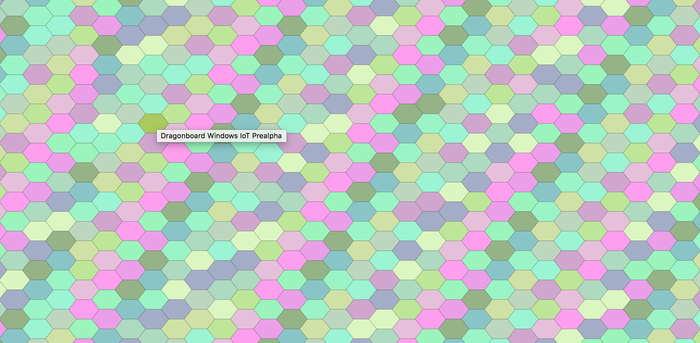

# Tessellate

This repo makes up the service and frontend of the Tessellate IoT project. In its current state I guess you could say it's an art project. It doesn't do much, but man can it scale.

At present the core receives (very limited) data from devices (going on 20, [add your own](https://github.com/cachilders/tessellate-peripheral)) and visualizes each ping as a hex of a color (relatively) unique to the sender.

The backend is Express. The frontend is React (scaffolded with create-react-app). It gets a lot of help from the delightful [react-hexgrid](https://github.com/Hellenic/react-hexgrid) library.

It will grow. For now it's just pretty.